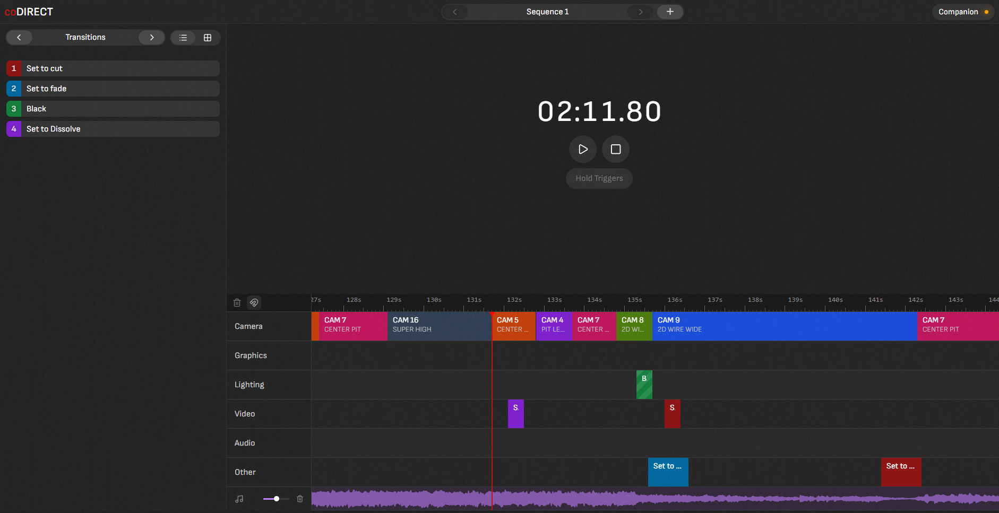

# coDIRECT

<p align="center">
  <a href="https://discord.com/invite/TVh2bbYx">
    
  </a>
  <a href="https://ko-fi.com/codirect/?hidefeed=true&widget=true">
    
  </a>
</p>

<br/>

Welcome to the [coDIRECT](https://codirect.live) GitHub repository, a powerful timeline automation engine designed for seamless integration with [Bitfocus Companion](https://bitfocus.io/companion).

coDIRECT is an advanced, open-source solution that empowers technical directors and broadcast engineers to synchronize, schedule, and orchestrate complex production workflows using precise, time-coded triggers. Whether you are automating multi-camera switching for a live broadcast or triggering complex lighting cues, coDIRECT scales efficiently to give you professional-grade control in a browser-based interface.

<br/>

<p align="center">
  
</p>

<br/>

## 🚀 Key Features

*   **Zero-Friction Start:** No accounts, no sign-ups, and no tracking. Get started in under 30 seconds.
*   **Companion Integration:** Seamless integration with Bitfocus Companion for streamlined workflow management.
*   **Precision Automation:** Precise, time-coded triggers for accurate, reliable automation.
*   **Scalable Architecture:** Flexible design for adaptability in environments of any size.
*   **Open Source:** Built for the community, ensuring accessibility and collaborative growth.

<br/>

## ⚙️ How It Works

coDIRECT acts as the "brain" of your production timeline, sending commands to your existing infrastructure:

`[coDIRECT Timeline]` -> `[HTTP Triggers]` -> `[Bitfocus Companion]` -> `[Production Actions]`

<br/>

## 🛠 Getting Started

To begin using coDIRECT, just open it in your browser:
[https://codirect.live](https://codirect.live)

For comprehensive documentation and support resources, visit the [coDIRECT documentation](https://docs.codirect.live) page. 

**Ready to automate your production?** [Launch coDIRECT](https://codirect.live) and set up your first cue in under a minute.

<br/>

## 🤝 Contributing

coDIRECT is an open-source project, and we welcome contributions from the community! Whether you're a developer, technical director, or broadcast engineer, your input helps shape the future of coDIRECT.

### Request a feature
If you are not a developer, feel welcome to request a feature [in this form](https://tally.so/r/rjgEeR)

### How to Contribute
1.  **Fork the Repository:** Click the "Fork" button in the top right corner.
2.  **Create a Branch:** `git checkout -b feature/your-feature-name`
3.  **Make your Changes:** Implement your feature or bug fix.
4.  **Commit:** `git commit -m "Add: descriptive message"`
5.  **Push:** `git push origin feature/your-feature-name`
6.  **Pull Request:** Open a PR against the `main` branch with a clear description of your changes.

### 🔨 How to build
After forking the repository, inside the root folder run these commands:

```bash
npm install
npm run dev
```
You will need NodeJS installed on your system.

Join our community on [Discord](https://discord.com/invite/TVh2bbYx) to discuss ideas, share knowledge, and collaborate on the development of coDIRECT.

## 📜 License
This project is licensed under the [MIT License](LICENSE).
